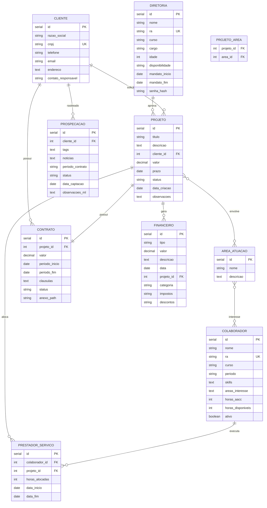

# Diagrama Entidade-Relacionamento — EJM

## Entidades Principais
| Entidade | Descrição |
|----------|-----------|
| DIRETORIA | 23 sócios, 1 cargo cada, mandato variável |
| COLABORADOR | Alunos interessados, cadastrados pela diretoria |
| PRESTADOR_SERVICO | Colaboradores alocados em projetos |
| CLIENTE | Empresas da região de Capão Bonito |
| PROJETO | Consultorias multidisciplinares |
| CONTRATO | Sempre vinculado a um projeto |
| FINANCEIRO | Entradas, saídas, despesas, infraestrutura |
| AREA_ATUACAO | Silvicultura, Sistemas Inteligentes, Agroindústria, Mecanização |
| PROSPECACAO | ML com documentos, tracker de empresas, notícias |
