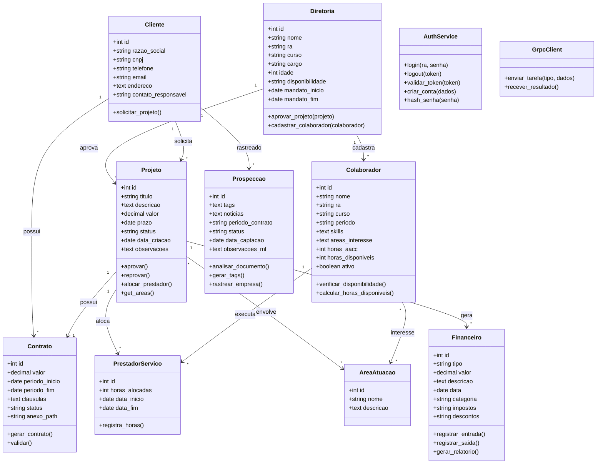

# Diagrama de Classes — EJM

## Responsabilidades

| Classe | Responsabilidade |
|--------|-----------------|
| Diretoria | Aprovar projetos, cadastrar colaboradores, gerenciar mandatos |
| Colaborador | Disponibilidade, skills, interesse em áreas, horas AACC |
| PrestadorServico | Alocação em projetos, registro de horas |
| Cliente | Dados cadastrais, solicitação de projetos |
| Projeto | ciclo de vida (criação → aprovação → execução → conclusão) |
| Contrato | Vinculado ao projeto, cláusulas, anexos |
| Financeiro | Entradas/saídas, relatórios, categorias |
| AreaAtuacao | Silvicultura, Sistemas Inteligentes, Agroindústria, Mecanização |
| Prospeccao | ML com documentos, tags, tracker de empresas, notícias |
| AuthService | JWT, hash de senhas, controle de acesso |
| GrpcClient | Comunicação Rails ↔ Rust para tarefas pesadas |
