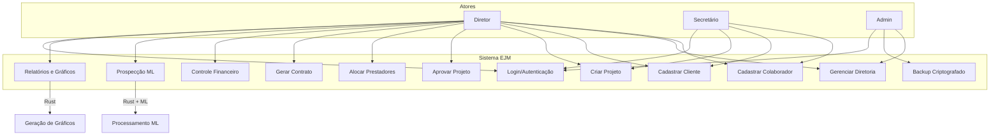

# Diagrama de Casos de Uso — EJM



## Atos e Permissões

| Atores | Permissões |
|--------|-----------|
| **Diretor** | Tudo (aprovar projetos, alocar, financeiro, prospecção, relatórios) |
| **Secretário** | Cadastrar colaboradores, clientes, criar projetos |
| **Admin** | Gerenciar diretoria, backup, configurações do sistema |

## Fluxos Principais

### 1. Aprovação de Projeto
```
Cliente solicita → Diretor cria projeto → Diretor analisa → Aprova/Reprova → Aloca prestadores
```

### 2. Prospecção de Clientes
```
Documentos históricos → Rust processa ML → Gera tags → Rastreia empresa → Notícias da área → Período de contrato
```

### 3. Registro de Colaboradores
```
Diretor cadastra aluno → Define skills/interesses → Colaborador fica disponível para alocação
```

### 4. Controle Financeiro
```
Projeto gera entrada → Registra despesas → Cálculo de impostos → Relatório
```
