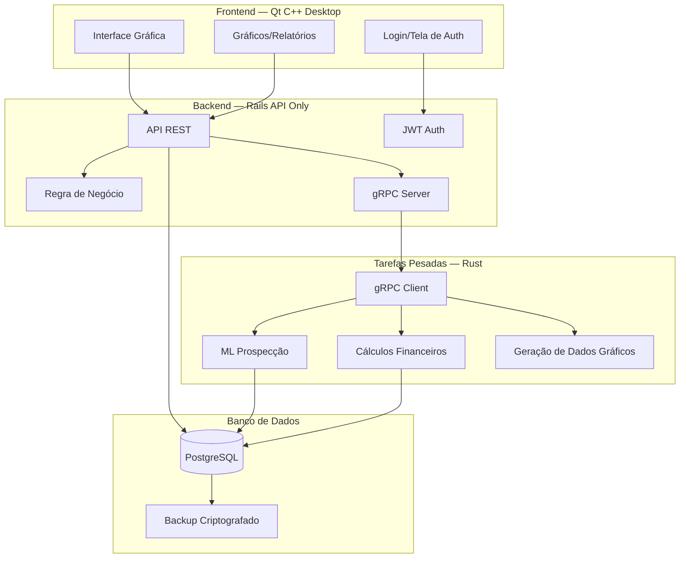

# Arquitetura do Sistema — EJM



## Componentes

### Frontend (Qt C++)
- **Interface gráfica desktop** — fluida, responsiva
- **Gráficos** — dados gerados pelo Rust
- **Tela de login** — autenticação JWT
- **0 web** — puramente desktop

### Backend (Rails API Only)
- **API REST** — endpoints para CRUD
- **Regra de negócio simples** — validações, fluxos
- **JWT Auth** — autenticação com hash de senhas
- **gRPC Server** — comunicação com Rust

### Tarefas Pesadas (Rust)
- **ML Prospecção** — análise de documentos, tags, tracker de empresas
- **Cálculos Financeiros** — impostos, descontos, relatórios
- **Geração de Gráficos** — dados processados para o Qt exibir
- **gRPC Client** — recebe tarefas do Rails

### Banco de Dados
- **PostgreSQL local** — dados persistentes
- **Backup criptografado** — segurança dos dados

## Fluxo de Comunicação

```
Qt Desktop → HTTP/REST → Rails API → PostgreSQL
                  ↓
            gRPC Server → gRPC Client → Rust (ML/Gráficos)
                  ↓
            Resultado → Rails → Qt Desktop (exibe)
```

## Segurança
- JWT para autenticação
- Hash de senhas (bcrypt)
- Login específico para cadastro de contas
- Backup criptografado
- PostgreSQL local (sem exposição à internet)
