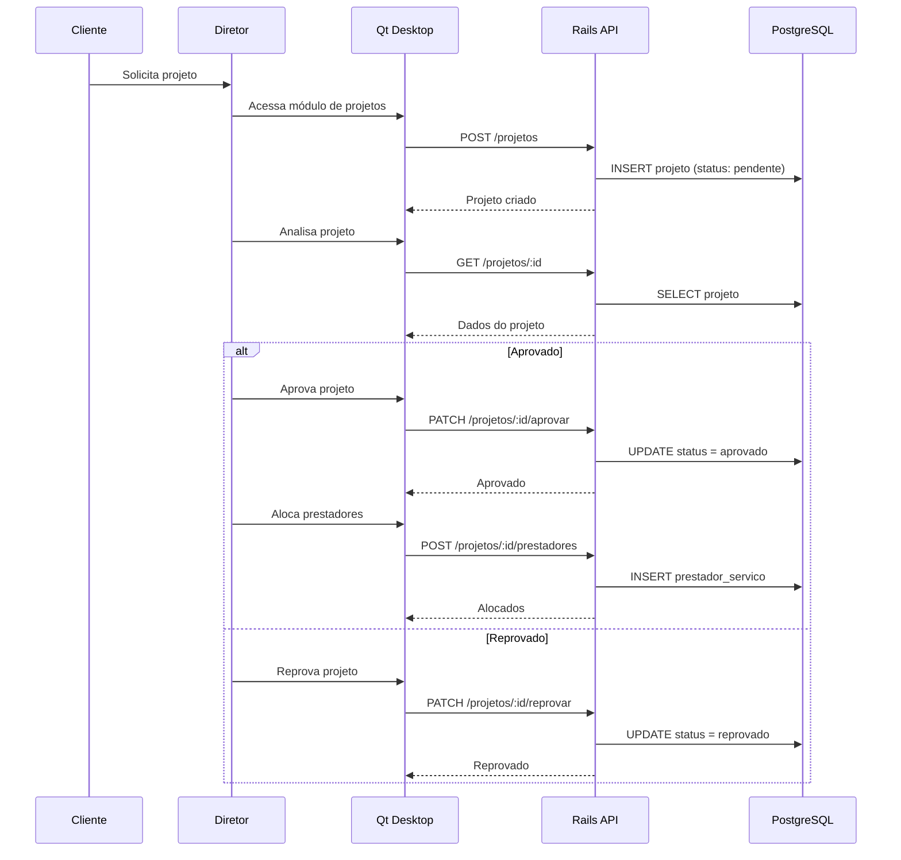
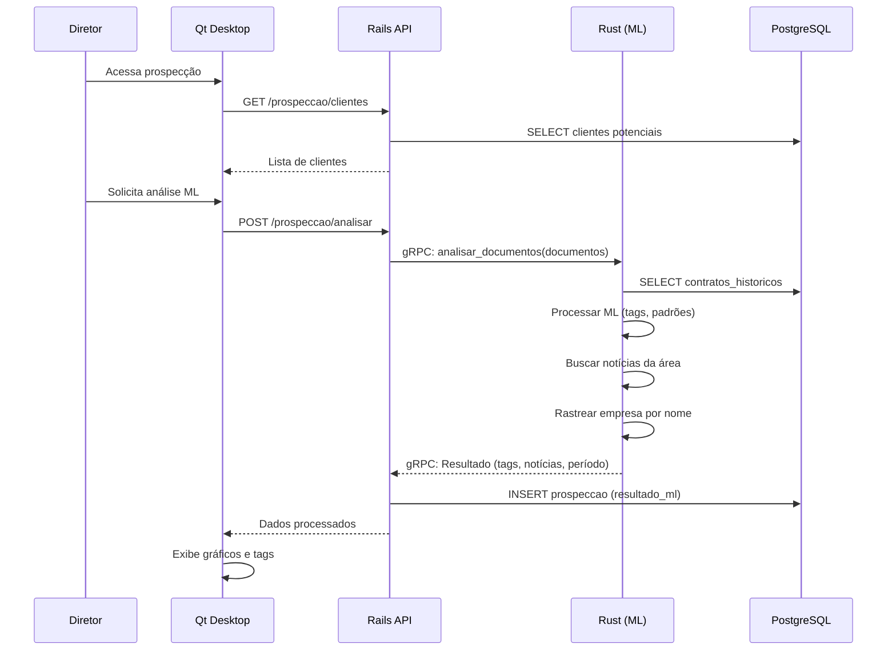
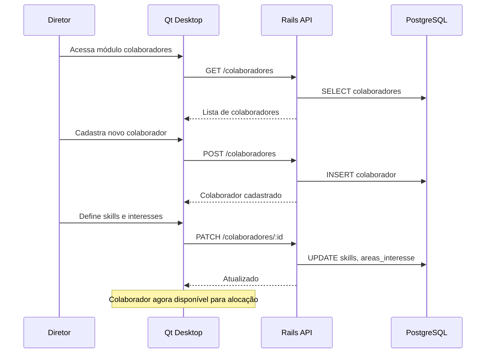
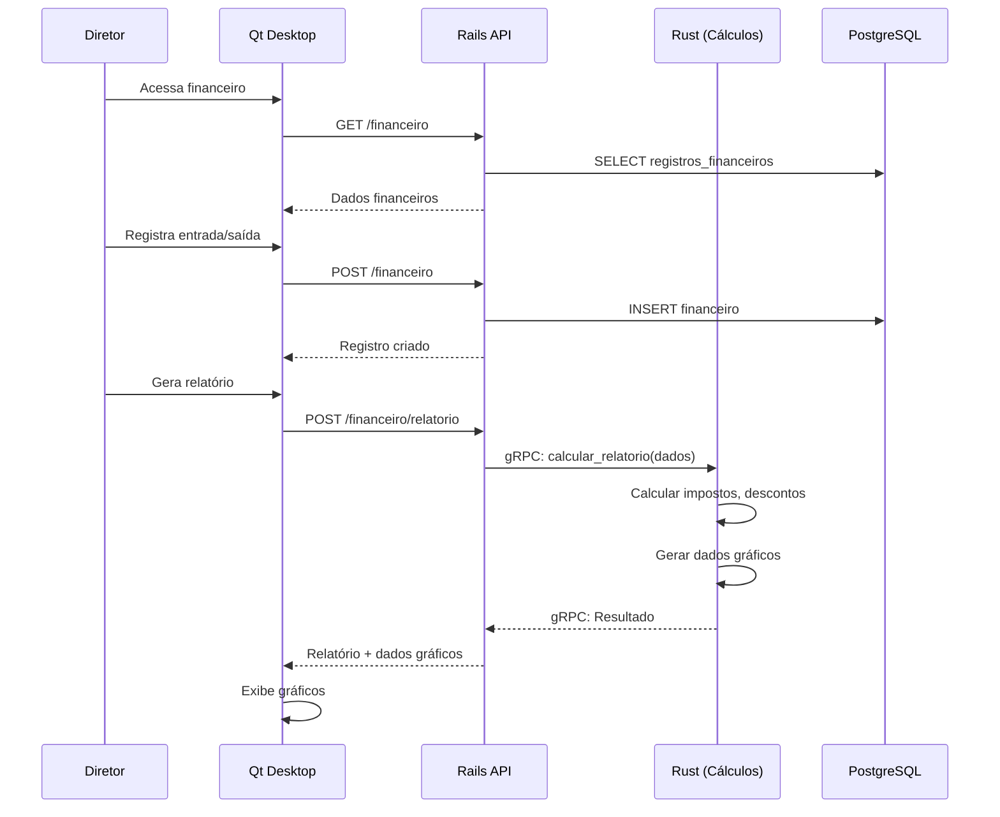

# Diagramas de Sequência — Fluxos Críticos EJM

## 1. Aprovação de Projeto

```mermaid
sequenceDiagram
    participant C as Cliente
    participant D as Diretor
    participant QT as Qt Desktop
    participant R as Rails API
    participant DB as PostgreSQL

    C->>D: Solicita projeto
    D->>QT: Acessa módulo de projetos
    QT->>R: POST /projetos
    R->>DB: INSERT projeto (status: pendente)
    R-->>QT: Projeto criado

    D->>QT: Analisa projeto
    QT->>R: GET /projetos/:id
    R->>DB: SELECT projeto
    R-->>QT: Dados do projeto

    alt Aprovado
        D->>QT: Aprova projeto
        QT->>R: PATCH /projetos/:id/aprovar
        R->>DB: UPDATE status = aprovado
        R-->>QT: Aprovado
        D->>QT: Aloca prestadores
        QT->>R: POST /projetos/:id/prestadores
        R->>DB: INSERT prestador_servico
        R-->>QT: Alocados
    else Reprovado
        D->>QT: Reprova projeto
        QT->>R: PATCH /projetos/:id/reprovar
        R->>DB: UPDATE status = reprovado
        R-->>QT: Reprovado
    end
```

## 2. Prospecção de Clientes (ML)

```mermaid
sequenceDiagram
    participant D as Diretor
    participant QT as Qt Desktop
    participant R as Rails API
    participant RS as Rust (ML)
    participant DB as PostgreSQL

    D->>QT: Acessa prospecção
    QT->>R: GET /prospeccao/clientes
    R->>DB: SELECT clientes potenciais
    R-->>QT: Lista de clientes

    D->>QT: Solicita análise ML
    QT->>R: POST /prospeccao/analisar
    R->>RS: gRPC: analisar_documentos(documentos)
    RS->>DB: SELECT contratos_historicos
    RS->>RS: Processar ML (tags, padrões)
    RS->>RS: Buscar notícias da área
    RS->>RS: Rastrear empresa por nome
    RS-->>R: gRPC: Resultado (tags, notícias, período)
    R->>DB: INSERT prospeccao (resultado_ml)
    R-->>QT: Dados processados
    QT->>QT: Exibe gráficos e tags
```

## 3. Registro de Colaboradores

```mermaid
sequenceDiagram
    participant D as Diretor
    participant QT as Qt Desktop
    participant R as Rails API
    participant DB as PostgreSQL

    D->>QT: Acessa módulo colaboradores
    QT->>R: GET /colaboradores
    R->>DB: SELECT colaboradores
    R-->>QT: Lista de colaboradores

    D->>QT: Cadastra novo colaborador
    QT->>R: POST /colaboradores
    R->>DB: INSERT colaborador
    R-->>QT: Colaborador cadastrado

    D->>QT: Define skills e interesses
    QT->>R: PATCH /colaboradores/:id
    R->>DB: UPDATE skills, areas_interesse
    R-->>QT: Atualizado

    Note over QT: Colaborador agora disponível para alocação
```

## 4. Controle Financeiro

```mermaid
sequenceDiagram
    participant D as Diretor
    participant QT as Qt Desktop
    participant R as Rails API
    participant RS as Rust (Cálculos)
    participant DB as PostgreSQL

    D->>QT: Acessa financeiro
    QT->>R: GET /financeiro
    R->>DB: SELECT registros_financeiros
    R-->>QT: Dados financeiros

    D->>QT: Registra entrada/saída
    QT->>R: POST /financeiro
    R->>DB: INSERT financeiro
    R-->>QT: Registro criado

    D->>QT: Gera relatório
    QT->>R: POST /financeiro/relatorio
    R->>RS: gRPC: calcular_relatorio(dados)
    RS->>RS: Calcular impostos, descontos
    RS->>RS: Gerar dados gráficos
    RS-->>R: gRPC: Resultado
    R-->>QT: Relatório + dados gráficos
    QT->>QT: Exibe gráficos
```
